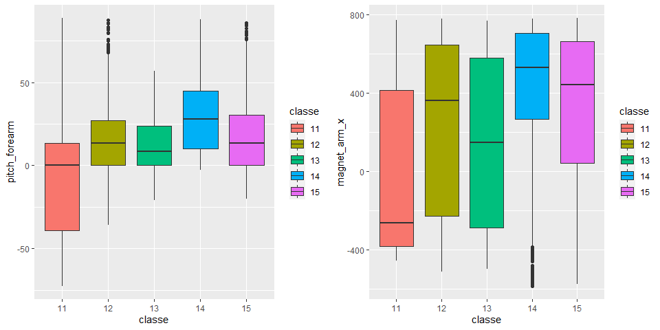
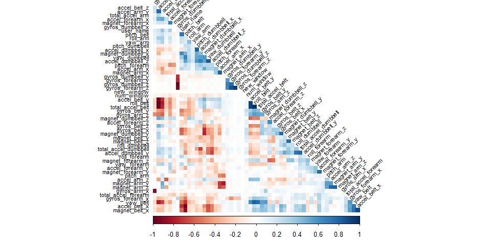
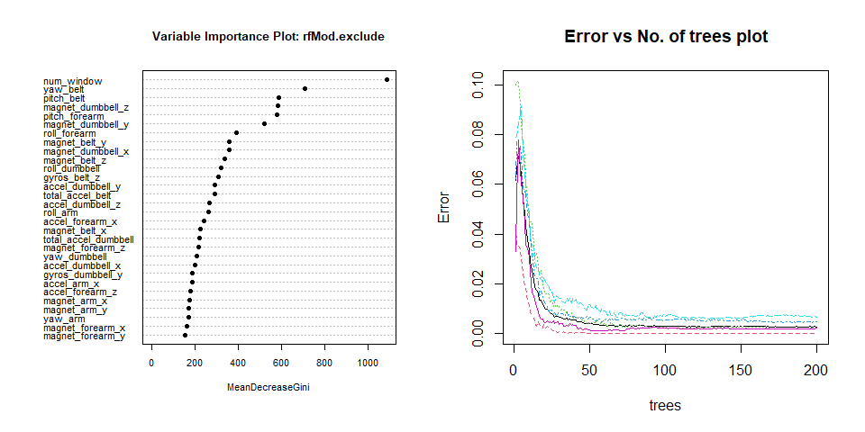

  
---
title: "Predictions using the Weight Lifting Exercises Dataset"
author: "Sankalp Piratla"
date: "24 October 2020"
output: 
  html_document:
    keep_md: yes
  pdf_document: default
---


## Executive Summary

Based on a dataset provide by HAR [http://groupware.les.inf.puc-rio.br/har](http://groupware.les.inf.puc-rio.br/har) we will try to train a predictive model to predict what exercise was performed using a dataset with 159 features


We'll take the following steps:

- Process the data, for use of this project
- Explore the data, especially focussing on the two paramaters we are interested in 
- Model selection, where we try different models to help us answer our questions
- Model examination, to see wether our best model holds up to our standards
- A Conclusion where we answer the questions based on the data
- Predicting the classification of the model on test set

## Processing

First change 'am' to  factor (0 = automatic, 1 = manual)
And make cylinders a factor as well (since it is not continious)


```r
training.raw <- read.csv("./data/pml-training.csv")
testing.raw <- read.csv("./data/pml-testing.csv")
```

## Exploratory data analyses 

Look at the dimensions & head of the dataset to get an idea

```r
# Res 1
dim(training.raw)
```

```
## [1] 19622   160
```

```r
# Res 2 - excluded because excessivness
# head(training.raw)
# Res 3 - excluded because excessivness
#str(training.raw)
# Res 4 - excluded because excessivness
#summary(training.raw)
```


What we see is a lot of data with NA / empty values. Let's remove those


```r
maxNAPerc = 20
maxNACount <- nrow(training.raw) / 100 * maxNAPerc
removeColumns <- which(colSums(is.na(training.raw) | training.raw=="") > maxNACount)
training.cleaned01 <- training.raw[,-removeColumns]
testing.cleaned01 <- testing.raw[,-removeColumns]
```

Also remove all time related data, since we won't use those


```r
removeColumns <- grep("timestamp", names(training.cleaned01))
training.cleaned02 <- training.cleaned01[,-c(1, removeColumns )]
testing.cleaned02 <- testing.cleaned01[,-c(1, removeColumns )]
```

Then convert all factors to integers

```r
classeLevels <- levels(training.cleaned02$classe)
training.cleaned03 <- data.frame(data.matrix(training.cleaned02))
training.cleaned03$classe <- factor(training.cleaned03$classe, labels=1)
testing.cleaned03 <- data.frame(data.matrix(testing.cleaned02))
```

Finally set the dataset to be explored


```r
training.cleaned <- training.cleaned03
testing.cleaned <- testing.cleaned03
```


## Exploratory data analyses 

Since the test set provided is the the ultimate validation set, we will split the current training in a test and train set to work with.


```r
set.seed(19791108)
library(caret)
classeIndex <- which(names(training.cleaned) == "classe")
partition <- createDataPartition(y=training.cleaned$classe, p=0.75, list=FALSE)
training.subSetTrain <- training.cleaned[partition, ]
training.subSetTest <- training.cleaned[-partition, ]
```

What are some fields that have high correlations with the classe?


```r
correlations <- cor(training.subSetTrain[, -classeIndex], as.numeric(training.subSetTrain$classe))
bestCorrelations <- subset(as.data.frame(as.table(correlations)), abs(Freq)>0.3)
bestCorrelations
```

```
##             Var1 Var2     Freq
## 44 pitch_forearm    A 0.336018
```

Even the best correlations with classe are hardly above 0.3
Let's check visually if there is indeed hard to use these 2 as possible simple linear predictors.


```r
library(Rmisc)
library(ggplot2)
p1 <- ggplot(training.subSetTrain, aes(classe,pitch_forearm)) + 
  geom_boxplot(aes(fill=classe))
p2 <- ggplot(training.subSetTrain, aes(classe, magnet_arm_x)) + 
  geom_boxplot(aes(fill=classe))
multiplot(p1,p2,cols=2)
```

<!-- -->

Clearly there is no hard seperation of classes possible using only these 'highly' correlated features.
Let's train some models to get closer to a way of predicting these classe's

## Model selection 

Let's identify variables with high correlations amongst each other in our set, so we can possibly exclude them from the pca or training. 

We will check afterwards if these modifications to the dataset make the model more accurate (and perhaps even faster)


```r
library(corrplot)
correlationMatrix <- cor(training.subSetTrain[, -classeIndex])
highlyCorrelated <- findCorrelation(correlationMatrix, cutoff=0.9, exact=TRUE)
excludeColumns <- c(highlyCorrelated, classeIndex)
corrplot(correlationMatrix, method="color", type="lower", order="hclust", tl.cex=0.70, tl.col="black", tl.srt = 45, diag = FALSE)
```

<!-- -->

We see that there are some features that aree quite correlated with each other.
We will have a model with these excluded. Also we'll try and reduce the features by running PCA on all and the excluded subset of the features


```r
pcaPreProcess.all <- preProcess(training.subSetTrain[, -classeIndex], method = "pca", thresh = 0.99)
training.subSetTrain.pca.all <- predict(pcaPreProcess.all, training.subSetTrain[, -classeIndex])
training.subSetTest.pca.all <- predict(pcaPreProcess.all, training.subSetTest[, -classeIndex])
testing.pca.all <- predict(pcaPreProcess.all, testing.cleaned[, -classeIndex])
pcaPreProcess.subset <- preProcess(training.subSetTrain[, -excludeColumns], method = "pca", thresh = 0.99)
training.subSetTrain.pca.subset <- predict(pcaPreProcess.subset, training.subSetTrain[, -excludeColumns])
training.subSetTest.pca.subset <- predict(pcaPreProcess.subset, training.subSetTest[, -excludeColumns])
testing.pca.subset <- predict(pcaPreProcess.subset, testing.cleaned[, -classeIndex])
```

Now we'll do some actual Random Forest training.
We'll use 200 trees, because I've already seen that the error rate doesn't decline a lot after say 50 trees, but we still want to be thorough.
Also we will time each of the 4 random forest models to see if when all else is equal one pops out as the faster one.


```r
library(randomForest)
ntree <- 200 #This is enough for great accuracy (trust me, I'm an engineer). 
start <- proc.time()
rfMod.cleaned <- randomForest(
  x=training.subSetTrain[, -classeIndex], 
  y=training.subSetTrain$classe,
  xtest=training.subSetTest[, -classeIndex], 
  ytest=training.subSetTest$classe, 
  ntree=ntree,
  keep.forest=TRUE,
  proximity=TRUE) #do.trace=TRUE
proc.time() - start
```

```
##    user  system elapsed 
##   71.54    0.91   72.48
```

```r
start <- proc.time()
rfMod.exclude <- randomForest(
  x=training.subSetTrain[, -excludeColumns], 
  y=training.subSetTrain$classe,
  xtest=training.subSetTest[, -excludeColumns], 
  ytest=training.subSetTest$classe, 
  ntree=ntree,
  keep.forest=TRUE,
  proximity=TRUE) #do.trace=TRUE
proc.time() - start
```

```
##    user  system elapsed 
##   70.47    1.42   71.92
```

```r
start <- proc.time()
rfMod.pca.all <- randomForest(
  x=training.subSetTrain.pca.all, 
  y=training.subSetTrain$classe,
  xtest=training.subSetTest.pca.all, 
  ytest=training.subSetTest$classe, 
  ntree=ntree,
  keep.forest=TRUE,
  proximity=TRUE) #do.trace=TRUE
proc.time() - start
```

```
##    user  system elapsed 
##   71.41    3.22   74.64
```

```r
start <- proc.time()
rfMod.pca.subset <- randomForest(
  x=training.subSetTrain.pca.subset, 
  y=training.subSetTrain$classe,
  xtest=training.subSetTest.pca.subset, 
  ytest=training.subSetTest$classe, 
  ntree=ntree,
  keep.forest=TRUE,
  proximity=TRUE) #do.trace=TRUE
proc.time() - start
```

```
##    user  system elapsed 
##   76.66    4.87   81.93
```

## Model examination

Now that we have 4 trained models, we will check the accuracies of each.
(There probably is a better way, but this still works good)


```r
rfMod.cleaned
```

```
## 
## Call:
##  randomForest(x = training.subSetTrain[, -classeIndex], y = training.subSetTrain$classe,      xtest = training.subSetTest[, -classeIndex], ytest = training.subSetTest$classe,      ntree = ntree, proximity = TRUE, keep.forest = TRUE) 
##                Type of random forest: classification
##                      Number of trees: 200
## No. of variables tried at each split: 7
## 
##         OOB estimate of  error rate: 0.28%
## Confusion matrix:
##      11   12   13   14   15  class.error
## 11 4184    0    0    0    1 0.0002389486
## 12    5 2841    2    0    0 0.0024578652
## 13    0   10 2557    0    0 0.0038955980
## 14    0    0   17 2395    0 0.0070480929
## 15    0    0    0    6 2700 0.0022172949
##                 Test set error rate: 0.31%
## Confusion matrix:
##      11  12  13  14  15 class.error
## 11 1395   0   0   0   0 0.000000000
## 12    4 942   3   0   0 0.007376185
## 13    0   2 853   0   0 0.002339181
## 14    0   0   1 802   1 0.002487562
## 15    0   0   0   4 897 0.004439512
```

```r
rfMod.cleaned.training.acc <- round(1-sum(rfMod.cleaned$confusion[, 'class.error']),3)
paste0("Accuracy on training: ",rfMod.cleaned.training.acc)
```

```
## [1] "Accuracy on training: 0.984"
```

```r
rfMod.cleaned.testing.acc <- round(1-sum(rfMod.cleaned$test$confusion[, 'class.error']),3)
paste0("Accuracy on testing: ",rfMod.cleaned.testing.acc)
```

```
## [1] "Accuracy on testing: 0.983"
```

```r
rfMod.exclude
```

```
## 
## Call:
##  randomForest(x = training.subSetTrain[, -excludeColumns], y = training.subSetTrain$classe,      xtest = training.subSetTest[, -excludeColumns], ytest = training.subSetTest$classe,      ntree = ntree, proximity = TRUE, keep.forest = TRUE) 
##                Type of random forest: classification
##                      Number of trees: 200
## No. of variables tried at each split: 6
## 
##         OOB estimate of  error rate: 0.28%
## Confusion matrix:
##      11   12   13   14   15  class.error
## 11 4184    1    0    0    0 0.0002389486
## 12    4 2842    2    0    0 0.0021067416
## 13    0   12 2555    0    0 0.0046747176
## 14    0    0   15 2396    1 0.0066334992
## 15    0    0    0    6 2700 0.0022172949
##                 Test set error rate: 0.29%
## Confusion matrix:
##      11  12  13  14  15 class.error
## 11 1395   0   0   0   0 0.000000000
## 12    2 945   2   0   0 0.004214963
## 13    0   4 851   0   0 0.004678363
## 14    0   0   3 800   1 0.004975124
## 15    0   0   0   2 899 0.002219756
```

```r
rfMod.exclude.training.acc <- round(1-sum(rfMod.exclude$confusion[, 'class.error']),3)
paste0("Accuracy on training: ",rfMod.exclude.training.acc)
```

```
## [1] "Accuracy on training: 0.984"
```

```r
rfMod.exclude.testing.acc <- round(1-sum(rfMod.exclude$test$confusion[, 'class.error']),3)
paste0("Accuracy on testing: ",rfMod.exclude.testing.acc)
```

```
## [1] "Accuracy on testing: 0.984"
```

```r
rfMod.pca.all
```

```
## 
## Call:
##  randomForest(x = training.subSetTrain.pca.all, y = training.subSetTrain$classe,      xtest = training.subSetTest.pca.all, ytest = training.subSetTest$classe,      ntree = ntree, proximity = TRUE, keep.forest = TRUE) 
##                Type of random forest: classification
##                      Number of trees: 200
## No. of variables tried at each split: 6
## 
##         OOB estimate of  error rate: 2.08%
## Confusion matrix:
##      11   12   13   14   15 class.error
## 11 4162   11    1    8    3 0.005495818
## 12   49 2775   18    2    4 0.025632022
## 13    5   30 2509   21    2 0.022594468
## 14    3    1  100 2300    8 0.046434494
## 15    1    7   14   18 2666 0.014781966
##                 Test set error rate: 1.71%
## Confusion matrix:
##      11  12  13  14  15 class.error
## 11 1387   4   0   3   1 0.005734767
## 12   14 930   5   0   0 0.020021075
## 13    1  11 836   6   1 0.022222222
## 14    1   0  23 777   3 0.033582090
## 15    0   0   7   4 890 0.012208657
```

```r
rfMod.pca.all.training.acc <- round(1-sum(rfMod.pca.all$confusion[, 'class.error']),3)
paste0("Accuracy on training: ",rfMod.pca.all.training.acc)
```

```
## [1] "Accuracy on training: 0.885"
```

```r
rfMod.pca.all.testing.acc <- round(1-sum(rfMod.pca.all$test$confusion[, 'class.error']),3)
paste0("Accuracy on testing: ",rfMod.pca.all.testing.acc)
```

```
## [1] "Accuracy on testing: 0.906"
```

```r
rfMod.pca.subset
```

```
## 
## Call:
##  randomForest(x = training.subSetTrain.pca.subset, y = training.subSetTrain$classe,      xtest = training.subSetTest.pca.subset, ytest = training.subSetTest$classe,      ntree = ntree, proximity = TRUE, keep.forest = TRUE) 
##                Type of random forest: classification
##                      Number of trees: 200
## No. of variables tried at each split: 6
## 
##         OOB estimate of  error rate: 2.43%
## Confusion matrix:
##      11   12   13   14   15 class.error
## 11 4155    8    9   10    3 0.007168459
## 12   69 2741   29    5    4 0.037570225
## 13    2   33 2510   20    2 0.022204908
## 14    7    3  104 2292    6 0.049751244
## 15    2    9   20   13 2662 0.016260163
##                 Test set error rate: 1.96%
## Confusion matrix:
##      11  12  13  14  15 class.error
## 11 1387   3   2   3   0 0.005734767
## 12   18 924   7   0   0 0.026343519
## 13    0  12 838   4   1 0.019883041
## 14    0   1  27 774   2 0.037313433
## 15    1   3   9   3 885 0.017758047
```

```r
rfMod.pca.subset.training.acc <- round(1-sum(rfMod.pca.subset$confusion[, 'class.error']),3)
paste0("Accuracy on training: ",rfMod.pca.subset.training.acc)
```

```
## [1] "Accuracy on training: 0.867"
```

```r
rfMod.pca.subset.testing.acc <- round(1-sum(rfMod.pca.subset$test$confusion[, 'class.error']),3)
paste0("Accuracy on testing: ",rfMod.pca.subset.testing.acc)
```

```
## [1] "Accuracy on testing: 0.893"
```

## Conclusion

This concludes that nor PCA doesn't have a positive of the accuracy (or the process time for that matter)
The `rfMod.exclude` perform's slightly better then the 'rfMod.cleaned'

We'll stick with the `rfMod.exclude` model as the best model to use for predicting the test set.
Because with an accuracy of 98.7% and an estimated OOB error rate of 0.23% this is the best model.


Before doing the final prediction we will examine the chosen model more in depth using some plots


```r
par(mfrow=c(1,2)) 
varImpPlot(rfMod.exclude, cex=0.7, pch=16, main='Variable Importance Plot: rfMod.exclude')
plot(rfMod.exclude, , cex=0.7, main='Error vs No. of trees plot')
```

<!-- -->

```r
par(mfrow=c(1,1)) 
```

<!-- To really look in depth at the distances between predictions we can use MDSplot and cluster predictiosn and results -->

<!-- ```{r} -->
<!-- start <- proc.time() -->
<!-- library(RColorBrewer) -->
<!-- palette <- brewer.pal(length(classeLevels), "Set1") -->
<!-- rfMod.mds <- MDSplot(rfMod.exclude, as.factor(classeLevels), k=2, pch=20, palette=palette) -->
<!-- library(cluster) -->
<!-- rfMod.pam <- pam(1 - rfMod.exclude$proximity, k=length(classeLevels), diss=TRUE) -->
<!-- plot( -->
<!--   rfMod.mds$points[, 1],  -->
<!--   rfMod.mds$points[, 2],  -->
<!--   pch=rfMod.pam$clustering+14,  -->
<!--   col=alpha(palette[as.numeric(training.subSetTrain$classe)],0.5),  -->
<!--   bg=alpha(palette[as.numeric(training.subSetTrain$classe)],0.2),  -->
<!--   cex=0.5, -->
<!--   xlab="x", ylab="y") -->
<!-- legend("bottomleft", legend=unique(rfMod.pam$clustering), pch=seq(15,14+length(classeLevels)), title = "PAM cluster") -->
<!--   legend("topleft", legend=classeLevels, pch = 16, col=palette, title = "Classification") -->
<!-- proc.time() - start -->
<!-- ``` -->


# Test results

Although we've chosen the `rfMod.exclude` it's still nice to see what the other 3 models would predict on the final test set.
Let's look at predictions for all models on the final test set. 


```r
predictions <- t(cbind(
    exclude=as.data.frame(predict(rfMod.exclude, testing.cleaned[, -excludeColumns]), optional=TRUE),
    cleaned=as.data.frame(predict(rfMod.cleaned, testing.cleaned), optional=TRUE),
    pcaAll=as.data.frame(predict(rfMod.pca.all, testing.pca.all), optional=TRUE),
    pcaExclude=as.data.frame(predict(rfMod.pca.subset, testing.pca.subset), optional=TRUE)
))
predictions
```

```
##            1    2    3    4    5    6    7    8    9    10   11   12   13   14   15   16   17   18   19   20  
## exclude    "12" "11" "12" "11" "11" "15" "14" "12" "11" "11" "12" "13" "12" "11" "15" "15" "11" "12" "12" "12"
## cleaned    "12" "11" "12" "11" "11" "15" "14" "12" "11" "11" "12" "13" "12" "11" "15" "15" "11" "12" "12" "12"
## pcaAll     "12" "11" "12" "11" "11" "13" "14" "12" "11" "11" "12" "13" "12" "11" "15" "15" "11" "12" "12" "12"
## pcaExclude "12" "11" "12" "11" "11" "15" "14" "12" "11" "11" "12" "13" "12" "11" "15" "15" "11" "12" "12" "12"
```

The predictions don't really change a lot with each model, but since we have most faith in the `rfMod.exclude`, we'll keep that as final answer.
